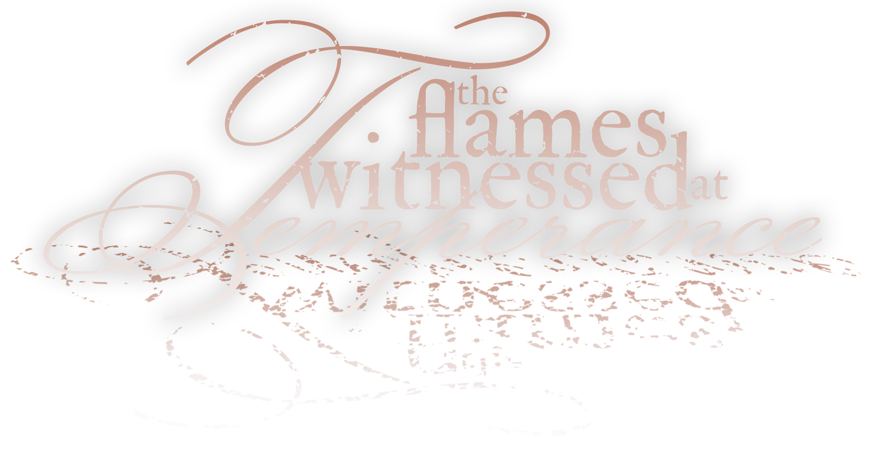
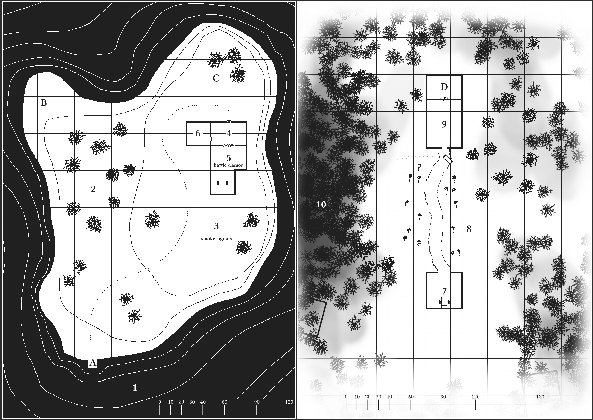

## About
The Flames Witnessed at Temperance is a tiny adventure location designed for 4 to 6 characters of levels 1 to 3. It is heavily inspired by the dungeon synth album [The Sleeping Wizard by Umbría.](https://umbriasynth.bandcamp.com/album/the-sleeping-wizard)

Concept, writing, title design, maps, and layout by D. D. Gant.  
Edited by V. Boško Gladyak. Cover art by Joan Llopis Doménech.

View in fullscreen for ease of use. Press F11 to toggle.

## History
The isolated islet of Temperance floats less than a league from the stony shore of the gray sea. A weathered structure of brick and plank supports a blocky tower, its silhouette visible in the hazy ocean sunrise of the waning year. The wisest elders recall the place once home to an eccentric scholar and practitioner of damnable magics. For the better part of the passing century, the lighthouse has stood dormant, the forces of nature all but reclaiming its utilitarian facade. Of late and now, the crabbers and leech collectors report a dim, colorless light on the horizon during the early morning hours of their commute. A light that does not go out. Days pass, and the rumor spreads. The coast is alive with story, and the flames at Temperance burn once more.

The wizard of the islet, Prowst, has entered a deep, magical slumber, waiting for the result of a century-long experiment. He entrusts his faithful familiar, Eku the toad, to care for the complex and guard against malicious intruders. One of Prowst’s academic rivals has sent their own familiar, Nima the rat, to meddle with the experiment. The forces of Nima act to prevent the wizard’s rousing as his uneasy dreams seep into reality. In distress, Eku lit the beacon atop the lighthouse, chancing to attract a savior to rescue Prowst and sway the fate of the islet of Temperance— before its doom.

## Waking Up
Everything strange happening on the islet is a part of a dream or a nightmare. Real creatures that die in either one of these alternate realities do not actually die— they Wake Up— in a cold sweat at a random location upon the islet.

|**Roll 1d6**|**Name**|**Area**|
|---|---|---:|
|1 | Lying on the Dock | [A](#a-brittle-dock) |
|2 | Half-buried in the sand on the Half-Moon Shore | [B](#b-half-moon-shore) |
|3 | In the shade of the Trees that Will Remember | [2](#2-the-trees-will-remember) |
|4 | In the tall grass at the Path of the Fae Knight | [3](#3-path-of-the-fae-knight) |
|5 | Nestled in an armchair for the Lost Wanderer | [4](#4-healing-spells-for-the-lost-wanderer) |
|6 | In pews of the Sancta Sanctorum | [6](#6-sancta-sanctorum) |

Upon Waking Up, the character is free to travel back into the depths of the seeping dream until victory is achieved.

## Nightmare
The twisting thickets of [The Forest’s Hug (Area 10)](#10-the-forests-hug) lead deeper into the subconscious of the wizard’s nightmare. A dimensional door returns wanderers to the surface, but to a different branching reality that has skewed further toward chaos. Some areas feature nightmare affectations that are only visible after this point. Areas that do not feature nightmare affectations remain the same, realized darker and bleaker. It is not possible to return from the nightmare without either dying (Waking Up) or killing Prowst, forcing him to Wake Up.

## Maps

## Wandering Monsters
|**Roll 1d6**|**Encounter (Normal)**|**Encounter (Nightmare)**|**No.**|
|---|---|---|---:|
|1 | **Anthropomorphic rats** vandalize the islet. | Bloodthirsty, barb-tailed **bat-creatures** descend.| 1d6 |
|2 | **Deer** wearing prayer bead necklaces clip-clop out of a nearby room. | **Skeletons**, shovels in hand, solemnly dig their own graves. | 1d6 |
|3 | The red-cloaked wizard (a vision) passes betwixt distant objects. | A red-hot meteor fragment obliterates something nearby. | 
|4 | Harmless clumps of sentient fungus slither into unsuspecting boots. | Sections of the ground melt away into puddles of gooey black pudding. |
|5 | The islet shakes. Save vs paralysis or fall, breaking a fragile item. | The world goes dark for 1d6 turns. Without torchlight, you are lost. |
|6 | A slight gust blows a sprinkle of sand into the eyes of a random victim. Tired, they fall into *sleep* in 1d3 turns. | A single **mare**, a stunted, hairless, malicious dream demon, leaps upon the chest of its victim, toppling them. |

>Anthropomorphic Rat  
>**HD** ½, **Att** 1d2 (stab), **AC** 7 [12], **MV** 30'  
>**SV** F1, **ML** 8, **AL** C, **XP** 5

>Barb-Tailed Bat-Creature   
>**HD** 1, **Att** 1d3 (stab), **AC** 6 [13], **MV** 40'  
>**SV** F1, **ML** 7, **AL** C, **XP** 13  
>On hit, 2-in-6 chance to *cause fear* (save vs spells).

>Deer  
>**HD** 1, **Att** 1d3 (butt), **AC** 7 [12], **MV** 80'  
>**SV** F1, **ML** 5, **AL** N, **XP** 10  

>Skeleton  
>**HD** 1, **Att** 1d6 (club), **AC** 7 [12], **MV** 20'  
>**SV** F1, **ML** 12, **AL** C, **XP** 10  

>Mare  
>**HD** 2, **Att** 1d3/1d3 (claws), **AC** 7 [12], **MV** 30'  
>**SV** F3, **ML** 6, **AL** C, **XP** 50  
>Casts *sleep* on touch. Infravision 90'. Half damage from non-magical weapons. Half damage from cold-, electric-, fire-, and gas-based attacks.

## 1. Awakening the Sleeping Wizard
In defiance of expectantly calm conditions, the sea surrounding the islet turns turmoil upon approach. Tiny, impossible whirlpools and waterspouts spin up at random, and colorful lights of crimson and violet flash like lightning beneath the surface. Abyssal shelves are mistaken for imaginary leviathans, shifting and snapping in the direction of foolhardy trespassers. Any manned vessel remains calm and unperturbed in its voyage. 

Billy, a solo **hammerhead shark**, circles oncomers in preparation for a meal. He fears all things magic.  

>Shark  
>**HD** 2, **Att** 2d6 (bite), **AC** 5 [14], **MV** 60'  
>**SV** F2, **ML** 7, **AL** N, **XP** 25  
>(Special) Ram: on hit, save vs paralysis or become stunned for 2 rounds.  

### A. Brittle Dock
Sharp barnacles crawl up the worn legs of a shoddy, algae-ridden dock. At the end of the pier, a snapped mooring line clings to a wooden bollard that doubles as a signpost. The sun-bleached letters proclaim, “The Isle of Temperance”. Wearing heavy armor, there is a 2-in-6 chance to fall through a weakened dock plank. The shore drops off steeply. With no help, there is a 1-in-6 chance of drowning. With a fast reaction from a dexterous friend, there is only a 1-in-20 chance of drowning.

- [Northeast (3).](#3-path-of-the-fae-knight) A rough-worn trail leads up the hill where smoke signals rise.

- [Northwest (2).](#2-the-trees-will-remember) A crowded, deciduous grove.

#### *In a nightmare...*
The grey sea stretches out as far as the eye can see. Dark tormenting clouds of thunder and flame rumble over where the coastal mainland once lay. A moonless, starless sky looms overhead, a void to consume all hope.

## 2. The Trees Will Remember
Coastal redwoods offer shade to a slumping statue of a man, stained with spongy moss. Sharp sunbeams cut through the canopy, illuminating wayward gnats and hovering pollen. The statue, timeworn and wizardly, lifts its gaze and outstretched arms to the sky. Both hands have broken off. A rusted plaque reads, “He who holds nothing beholds the world, and there is beauty in his eyes”. The statue’s eyes contain 2 tiny emeralds (250 gp each).

- [South (1).](#1-awakening-the-sleeping-wizard) Across the grassy knoll lies a dilapidated dock.

- [East (3).](#3-path-of-the-fae-knight) A stoney trail climbs the hill toward the structure.

### B. Half-Moon Shore
Shrieking seabirds dive at the shore. Fine white sand erupts with turtle hatchlings scrambling toward the sea. Half-buried crab cages entomb expired crustaceans where the gulls cannot reach.

### C. Unstable Portal
A steady stream of **anthropomorphic rats**, dressed in miniature brigand outfits, pile out of a swirling vortex in the mouth of an overturned wheelbarrow. They cartoonishly clamber up the walls and through the door of the brick structure. 

Real creatures entering the portal teleport to the [Vault of the Mollusk (Area D).](#d-vault-of-the-mollusk)

>Anthropomorphic Rat (ꝏ)  
>**HD** ½, **Att** 1d2 (stab), **AC** 7 [12], **MV** 30'  
>**SV** F1, **ML** 8, **AL** C, **XP** 5

#### *In a nightmare...*
The islet is unrecognizable, a solitary rock stripped bare of all greenery. A giant ghost crab, Caesar, upsets the half-moon shore, crunching steel crab cages between his bulky claws.

>Giant Ghost Crab  
>**HD** 3, **Att** 2d6 (pincers), **AC** 4 [15], **MV** 30'  
>**SV** F3, **ML** 9, **AL** N, **XP** 35

## 3. Path of the Fae Knight
The trail trudges through swathes of tall grass spotted with clumps of curly dock weed. Bushy elder trees mark the islet’s crown where a pinstripe hammock[^1] stretches between the thick trunks. A shimmering figure tends a makeshift driftwood brazier laid with bundles of green grass. 

A shimmering figure tends a makeshift driftwood brazier laid with bundles of green grass. Quiet “Anna” Chirping-Sun, a dainty **wood elf**, casts irregular smoke signals into the air. Anna doesn’t know where she is, how she got here, or that she is only a figment of Prowst’s dream. She knows Prowst and holds him in friendly regard for helping identify magic artifacts (spell scrolls and a magic bow) for her family. She wants to get off the islet. If she leaves, or the dream ends, she ceases to exist.

>Wood Elf  
>**HD** 1+1*, **Att** 1d6 (bow), **AC** 5 [14], **MV** 40'  
>**SV** E1, **ML** 8, **AL** N, **XP** 19  
>Ready to cast *shield*.

- [Up (6).](#6-sancta-sanctorum) 30’ above, atop the sheer tower of the lighthouse, a heavy salt rock crystal pulsates in a dull glow. It hangs by thin twine under a deteriorating wooden canopy.

- [West (2).](#2-the-trees-will-remember) A mossy statue of a man nestles within a shady grove.

- [South (1).](#1-awakening-the-sleeping-wizard) Down the shallow slope lies a dilapidated dock.

- [North (4).](#4-healing-spells-for-the-lost-wanderer) The trail bends out of sight around a brick building. A locked door of rotting plank incorporates a leather pet flap.

#### *In a nightmare...*
A trio of misshapen **bat-creatures** with barbed tails and six wings peer over the edge of the lighthouse tower, ready for ambush.

>Barb-Tailed Bat-Creature (3)   
>**HD** 1, **Att** 1d3 (stab), **AC** 6 [13], **MV** 40'  
>**SV** F1, **ML** 7, **AL** C, **XP** 13  
>On hit, 2-in-6 chance to *cause fear* (save vs spells).

## 4. Healing Spells for the Lost Wanderer
Eccentric, unfashionable furnishings cramp this filthy lounge. Worn, tufted leather armchairs, one smaller than dwarf-sized, face a cobblestone hearth ablaze with green fire. The dusty mantle beset with
curios enshrines a faded portrait hanging above; a captious, elderly man meets the gaze of the beholder.

If spoken to, the **portrait of Prowst** exposes his real self is trapped in a magically-induced slumber down below. Outside forces, Nima and his rat-kin, are working to impede Prowst’s rousing. The wizard’s dreams are leaking into reality, and if he doesn’t Wake Up soon, a release of arcane force causes a devastating tsunami.

Atop the mantle, stuffed among glass jars of rabbit’s feet[^2] and empty crystal decanters (400 gp), is a tattered scroll of *healing*[^3].

- [West (6).](#6-sancta-sanctorum) A thick wood door affixed with a simple holy symbol.

- [South (5).](#5-the-dance-of-eku-and-nima) The clamor of battle accompanies a myriad of strange silhouettes visible through sheer curtains.

- [North (3).](#3-path-of-the-fae-knight) A grimy plank door with a hinged pet flap.

#### *In a nightmare...*
Heatless green flame creeps up the walls and around piles of ash. Nothing remains but the blackened stone— even the doors have burned away. The face of Prowst manifests in the fiery depths, laughing, and screaming.

## 5. The Dance of Eku and Nima
Colorful heraldic standards carried on miniature flag poles wave through brawling chaos. Eku, a bipedal toad wearing a felt hood, commands a mass of ribbiting **amphibians** against the invading forces of Nima, an evil-spirited rat. Nima dons a repurposed chainmail coif over fine silks, and waves a sewing needle in frantic command of his fellow **rat-kin**. The toads prepare to release a trained **tabby cat** into the fray.

>Toad (12)  
>**HD** ½, **Att** 1d2 (bite), **AC** 8 [11], **MV** 25'  
>**SV** F1, **ML** 10, **AL** N, **XP** 5

>Anthropomorphic Rat (14)  
>**HD** ½, **Att** 1d2 (stab), **AC** 7 [12], **MV** 30'  
>**SV** F1, **ML** 8, **AL** C, **XP** 5

>Tabby Cat    
>**HD** ½, **Att** 1d2 (scratch), **AC** 9 [10], **MV** 40'  
>**SV** NM, **ML** 6, **AL** N, **XP** 5

The battle here, and all of its participants, appears larger-than-life due to the affectations of Prowst’s dream state. Eku grants allies access to the cellar door, fending off the rats. If Nima and his forces are annihilated, reinforcements continue to arrive through the [Unstable Portal (Area C).](#c-unstable-portal)

- [Down (7).](#7-mystic-fungus-potion-fermentation) A red iron cellar door reveals a moldy wooden staircase. Warm, musty air washes over the descender.

- [North (4).](#4-healing-spells-for-the-lost-wanderer) Sheer silk curtains obscure the archway.

#### *In a nightmare...*
A dense fog settles over a sea of mounded soil. Rows of crumbling headstones and skewed monuments slowly sink into the dirt. An open sepulcher descends to the [vat room (Area 7).](#7-mystic-fungus-potion-fermentation)

With appropriate equipment, dig up and loot shallow graves one per turn. Roll on [*Treasure Table U*](https://www.ddgant.com/tools/) for grave contents. Every other turn there is a 2-in-6 chance **1d6+1 skeletons** attack from the grave.  

>Skeleton  
>**HD** 1, **Att** 1d6 (club), **AC** 7 [12], **MV** 20'  
>**SV** F1, **ML** 12, **AL** C, **XP** 10  

## 6. Sancta Sanctorum
A huge, glowing chunk of salt rock crowns a spotless shrine of redwood and marble. 30’ high walls vault up to a shoddy, oversized canopy that shelters the room, otherwise open to the exterior. White benches, cynically ornate, encircle a wide, bronze offering plate. Lawful runes inscribe a pristine mantle with symbols of purity, chastity, and temperance.

A contingent of **5 toadlings** hoist rat carcasses onto the offering plate, where they disintegrate in a flash of blue flame. The hanging chunk of salt rock pulsates in agreement.

Sacrificing detritus to the offering plate *blesses* the sacrificer, once per day, and provides ambient light and warmth to the complex. Prowst is not a pious man, but the god of purity need not know it.

- [East 4.](#4-healing-spells-for-the-lost-wanderer) A sharp staleness penetrates the porous wood door.

#### *In a nightmare...*
The **likeness of the god of purity** rests distraught on a bench before his shrine. Disappointed in his exploitation, he asks, “Does anyone understand the true meaning of purity?” If answered satisfactorily, he bestows *improved resist fire* (double resistance, lasts until end of day) upon the earnest responder. 

>Likeness of the God of Purity  
>**HD** 3+2*, **Att** 1d6 (mace), **AC** 3 [16], **MV** 40'  
>**SV** C4, **ML** 11, **AL** L, **XP** 50    
>Ready to cast *sticks to snakes* and *light*. 

A rolled-up scroll of parchment, a map, rests atop the shrine’s mantle. X marks the spot where it leads to buried treasure in the [Snow Garden (Area 8, Nightmare).](#8-the-snow-garden)

## 7. Mystic Fungus Potion Fermentation
A huge, smashed, cylindrical glass vat drips biogrowth fluid down to the metal tile floor. Clumps of nondescript fungus wriggle and crawl in no particular direction. Glass jars and stoppered flasks line the shelves of a well-used workbench.

Among the various containers of creature saliva and suspect secretions is a bubbling crystal flask blended with bees[^4].

- [Up (5).](#5-the-dance-of-eku-and-nima) Creaky stairs ascend to a red iron cellar door.

- [North (8).](#8-the-snow-garden) An open archway peers into a snowy garden.

## 8. The Snow Garden
A rift in reality gives way to an icy woodland. A cobbled path meanders through fields of frozen perennial flowers toward a central brick abode where wood smoke erupts from a bent iron chimney. Distant, snow-laden pines obscure a few scattered stone structures, all featureless, save for their arched entryways.

A horse-sized, vat-grown **fungus-octopus**, Hector, trudges and rolls through the high snow banks. Hector is telepathic and highly intelligent. He exposes Prowst’s sleep-walking escape, now presumed lost inside his own subconscious. He knows the only way to return Prowst’s corporeal body to reality is to travel deep into his own nightmare and slay him. This would threaten Hector’s existence, and he does all he can to prevent it from happening.

- [West (10).](#10-the-forests-hug) Footprints lead into a dark, canopied forest.

- [South (7).](#7-mystic-fungus-potion-fermentation) An open archway reveals a mystic laboratory.

- [North (9).](#9-last-night-awake) The wooden door to the brick house lies detached in a pile of snow, exploded off its hinges.

>Fungus Octopus    
>**HD** 3, **Att** 1d3*8 (tentacles), **AC** 7 [12], **MV** 30'  
>**SV** F3, **ML** 8, **AL** N, **XP** 35    
>3+ damage severs a tentacle, which regrows immediately. Creatures suffering 6+ fungal octopus damage must save vs poison or contract systemic mycosis and gain no benefits from rest (healing, spell memorization) until cured.  

|**Roll 1d6**|**Stone Structure Contents (Search 1 per turn)**|
|---|---|
|1 | A den of wet cushions and matted fur rugs. A silver dagger pins a deck of cards to a low wooden table. |
|2 | A noble child’s room. Vivid wallpaper depicts a desolate hellscape. Playthings spill from a **toy chest** that animates upon approach, chomping its victims. |
|3 | A gold-framed painting set on an easel depicts a cliffside monastery of whitewashed limestone (600 gp). |
|4 | A floor-to-ceiling pool of black, venomous snakes slither in defiance of gravity. The hilt of a broadsword[^5] pierces the center of the writhing den. |
|5 | A heavy silver statue of a cow (2,000 gp) is chained and padlocked to the flagstone floor. |
|6 | Toads perform ballet in a tiny, elaborate amphitheater. |

>Toy Chest  
>**HD** 2, **Att** 1d6 (chomp), **AC** 4 [15], **MV** 30'  
>**SV** F2, **ML** 9, **AL** C, **XP** 20     

>Venomous Snake  
>**HD** 2*, **Att** 1d3 (bite), **AC** 6 [13], **MV** 30'  
>**SV** F2, **ML** 7, **AL** N, **XP** 25  
>Infravision 30’. Always gains initiative. On bite, save vs poison or die.   

#### *In a nightmare...*
A brutal blizzard obstructs vision and reduces speed by half. Buried treasure exists in a spot only identifiable with a treasure map. There is a bag of small rubies (1,000 gp), a finely made yew shortbow[^6], and a scroll tube (contains *detect secret door (3 turns)* and *reincarnation*).

## 9. Last Night Awake
A disorderly bedspread lies vacant in a dusty chamber filled with homely comforts and contraptions of questionable practicality. An elaborate series of tubes, slides, bells, and whistles rests atop a fine
red rug (700 gp) of otherworldly patterns. A smaller bed, less than dwarf-sized, perches upon a cradling shelf above the headboard. 

A damaged **wood golem**, splintered and burnt, feeds a rickety wood stove. The golem attempts to serve its secondary function by gently tucking intruders into bed. The golem will prevent access to the [Vault of the Mollusk (Area D).](#d-vault-of-the-mollusk) The phrases “good morning” and “good night” stop and start the golem, respectively.

>Wood Golem  
>**HD** 2+2, **Att** 1d8 (crush), **AC** 7 [12], **MV** 40'  
>**SV** F1, **ML** 12, **AL** N, **XP** 25  
>Unaffected by non-magical weapons, gas, *charm*, *hold*, and *sleep*. Weak to fire. 

The elaborate contraption’s countdown clock has paused mid-swing due to a tiny needle stuck between the cogs. 7 days remain on the countdown. If the clock reaches zero, the contraption produces a red metal flask[^7], a glass of orange juice, and a fresh bread roll.

- [North (D).](#d-vault-of-the-mollusk) A secret door, plainly visible to magic-users.

- [South (8).](#8-the-snow-garden) A wooden door, smashed off its hinges.

### D. Vault of the Mollusk
Ambient, sourceless light washes over an ascetic chamber of white marble. A singular slab pedestal presents a gnarled wooden staff[^8] and a golden cup (1,200 gp). The opal head of the staff is carved in the shape of eight curling tentacles, like a blossoming flower.

- [South (9).](#9-last-night-awake) A stone door, plainly visible from this side.

## 10. The Forest's Hug
The dense, lonely thicket leads deeper and deeper into the black wood. A faded trail of footprints wanders west through the snowdrowned shrubbery. The trees grow taller, wider, and older. Branches
smother out the remaining light, and the forest closes in, turning dark as a tomb.

Under the spell of the beckoning nightmare, the adventuring party finds themselves stumbling out of the shady grove atop the islet [(Area 2, Nightmare)](#2-the-trees-will-remember), now transported to the nightmare world.

- [Deeper (2).](#2-the-trees-will-remember) The nightmare beckons...

#### *In a nightmare...*
A **red-cloaked wizard**, with fire in his eyes, sleepwalks through the endless thicket. Leafless oaks and scraggly pines burst into sporadic flame, and the low moon engulfs the sky. Prowst, fragile and easily-confused, sleepwalks through his own nightmare. Confrontation upsets the cursed flora. Every round of combat here, one random creature must save vs paralysis or be overcome by a chrysalis of crawling roots and brambles, rooted and restrained for 3 rounds or until cut out.

>Prowst, the Red-Cloaked Wizard, Sleep-Walking 
>**HD** 7*, **Att** 1d2 (unarmed), **AC** 9 [10], **MV** 40'  
>**SV** MU7, **ML** 8, **AL** N, **XP** 950   
>Ready to cast *wall of fire*, *fly*, *fire ball*, *mirror image*, *magic missile*, and *shield*.

Prowst’s death in the nightmare ends the strange effects upon the islet, and all characters wake in the [wizard’s lounge (Area 4).](#4-healing-spells-for-the-lost-wanderer) The portrait no longer speaks, and the hearth pops and blazes with plain fire. A less-anthropomorphic Eku ribbits from the perch of his miniature armchair. Prowst, alive and clear-minded, thanks the adventurers for their intervention, awarding the party with eight octopus-engraved gold rings[^9] (500 gp each).

## Appendix: Magic Items
[^1]: **Ponderer’s Hammock.** The hammock envelopes any creature with an intelligence score less than 9 that it comes into contact with. If thrown, roll to hit -2. Upon hit, save vs paralysis once per round or become enveloped, restricting all movement. After 3 rounds of envelopment, the creature remains enveloped permanently (unless assisted) and suffocates to death in a number of rounds equal to 1d6+the creature’s constitution modifier.
[^2]: **Rabbit’s Foot.** Worn as an amulet, negates one killing blow against the wearer, once per week.
[^3]: **Scroll of Healing.** Heal 1d6+2 wounds. Can be read by holy men and sorcerers alike.
[^4]: **Potion of Bees.** Turn into a swarm of bees. Lasts 2 turns.
[^5]: **Snakebite.** Two-handed sword, +1. A neutral or chaotically aligned creature may use a command word of their choice to turn the sword into a venomous snake under their control and back again.
[^6]: **Gift of Anna.** Shortbow, +1. Requires no ammunition. Arrows manifest as bright beams of light trailed by ethereal smoke.
[^7]: **Potion of Haste.** Act twice as quickly as normal. Lasts 3 turns.
[^8]: **Iridesca Rod.** Create a 10 ft diameter aura of flashing electric-blue rings. Those within the aura are *silenced*. Those outside the aura that do not avert their gaze must save vs paralysis or become partially blinded (-2 to hit). Lasts 3 rounds. Range 80 ft. Use once per day.
[^9]: **Ring of Sixth Sense.** The wearer telepathically senses unspoken signals and emotions of other *ring of sixth sense* wearers.